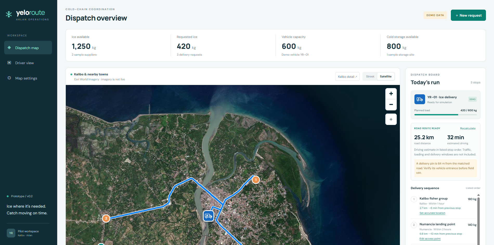
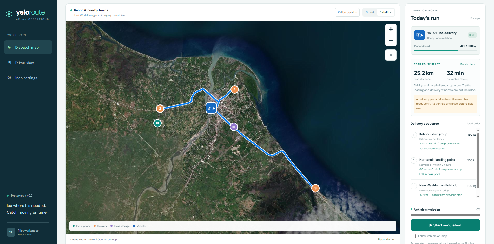

# YeloRoute Aklan

A local, mobile-friendly dispatcher and driver demo for coordinating ice deliveries. Built with editable HTML, CSS and JavaScript; no package installation or build process is required.

## Screenshots

### Dispatcher dashboard

### Road routing and delivery simulation

These screenshots show a configured satellite session and a user-adjusted demo route. They do not verify landing-port locations. New visitors start with a free street map; satellite imagery requires their own browser API key.

## Live demo on GitHub Pages
Satellite Test Key:AAPTa5RI0P3sbM4rtAHq9WIxvSA..YnklLF2J4ZipRaZeARJGg8KOdbSOW6uVDNG5qRKEUA452M2KhKLqpwnLQY1DuY5_eFQrKcxEzIGl13gAWEu7KvGJndpuojUOaNTcQqCjbeZM-6YoseCOKwNQTsnYNegkJdN9-yaudkdqXNokne6dcmxCWDox3jTz9ZkI9r-agIiBM3G9rjHBBUHe69S0LaPANACvKf_lZQTjBFectNVLcy2J5gMrZW70kwPnW-fFLfYehyuCAT1_fI5QVZX8

**[Try the live demo](https://azzzriieell00.github.io/yeloroute-aklan/)**

This repository includes `.github/workflows/pages.yml` to publish the web app automatically from the `main` branch. The live URL becomes available after the first successful deployment; it is shown in **Settings → Pages** and the **github-pages** deployment.

1. Create a public GitHub repository, for example `yeloroute-aklan`.
2. Upload this folder's **contents** to the repository root, including `.github/workflows/pages.yml`, `vendor/`, `scripts/`, and `docs/images/`. `index.html` should be in the root, not inside an extra parent folder.
3. Open **Settings → Pages → Build and deployment** and select **GitHub Actions** as the source.
4. Open **Actions → Deploy live demo to GitHub Pages → Run workflow** on `main`. Later pushes to `main` deploy automatically.
5. Wait for the deployment to finish, open the URL in **Settings → Pages**, and share it. Add that verified URL to this README once published.

The URL normally has the form `https://YOUR-USERNAME.github.io/yeloroute-aklan/`. GitHub Pages serves the static app over HTTPS; the Node development server is not deployed. Application assets use relative paths so the project subdirectory works.

Visitors can try street maps, road routing, capacity checks, the moving vehicle simulation, and driver handovers without an account or a map key. Their edits stay in their own browser. The default Numancia stop is a road-accessible **sample delivery**, not a verified port.

For satellite testing, open **Map settings**, choose the provider, and enter a browser-safe key. Add the published site's origin/referrer in your provider dashboard. Keys stay in the current page session and are not included in the repository or deployment. The live demo defaults to Street rather than sharing the owner's key with every visitor.

Deployment follows [GitHub's custom Pages workflow documentation](https://docs.github.com/en/pages/getting-started-with-github-pages/using-custom-workflows-with-github-pages).

## Start in Visual Studio Code

1. Open this folder in VS Code.
2. Install Node.js if it is not already available.
3. Open the integrated terminal and run `npm start`.
4. Open **http://localhost:4173** in your browser.

Alternatively, VS Code's Live Server extension can serve `index.html`. Use a local web server rather than double-clicking the file so service workers and browser features work correctly.

## Try the demo

- Pan/zoom the Kalibo-area street map and inspect facility markers.
- Wait for **ROAD ROUTE READY**, then start/pause the moving vehicle simulation. It follows the returned road geometry; reset to replay the initial sample.
- Add an ice delivery. A run over the 600 kg vehicle capacity is flagged and cannot be simulated.
- Switch to **Driver view** to record and undo sample handovers.
- Reload: requests and handover records remain in this browser's local storage. Reset restores the initial dataset.
- Select **Satellite**, choose MapTiler or Esri World Imagery, paste that provider's public browser key, and connect.
- Select **Kalibo detail** to inspect central Kalibo at building scale. Satellite image sharpness and age depend on the source's local coverage; zooming cannot add detail that is absent from the imagery.
- Driver view now includes expandable road directions and estimates for each leg.
- The vehicle now uses a truck graphic on the map and dispatch card.
- Each delivery has **Set accurate location / Edit access point**. Enter latitude/longitude or choose the vehicle entrance on the map. Saving preserves the coordinate in browser storage and recalculates the route. The original Numancia sample is not a verified landing port.

If connecting fails, the dialog displays the provider status. For MapTiler 403, confirm the key is active, enter `localhost` in Allowed HTTP Origins for this development server, leave Allowed user-agent header blank, and save the key settings. For Esri 403/498, check that your current ArcGIS Location Platform key includes basemap access and that its referrer restrictions allow this app. For 429, check account usage limits. Paste only the key, not a URL.

Keys are not written to disk or local storage. They remain in the current page's memory and are sent only to their respective imagery provider. Browser map keys are visible to browser users: restrict them to your app's allowed origins/referrers in the provider dashboard. Never put a secret backend key here. Provider changes keep the two keys separate.

## Map service and costs

Street imagery uses the public OpenStreetMap tile service with visible attribution. It is best-effort and subject to its usage policy; no offline tile downloads or prefetching are implemented. Leaflet 1.9.4 and its license are bundled in `vendor/`. Optional fonts load from Google Fonts with system-font fallbacks. An internet connection is needed for map imagery.

MapTiler Satellite uses the documented `satellite-v2` TileJSON dataset. Its free plan is suitable for qualifying noncommercial/R&D prototypes and has quotas; it is not unlimited free commercial hosting. This implementation uses Leaflet raster tiles, so request-based counting may apply.

Esri World Imagery uses the current authenticated ArcGIS Location Platform service on `ibasemaps-api.arcgis.com`. It requires your own account and a current API key with basemap access. The published Basemap Styles allowance is **2 million basemap tiles per month**, followed by billed usage. Check the account's current pricing and settings before connecting. No legacy public Esri endpoint or borrowed key is used. Tile service metadata supplies provider attribution.

Both are satellite/aerial basemaps, not live video. Actual Kalibo coverage, image age and sharpness must be inspected with your key. This prototype cannot promise imagery identical to Google Earth. No Google imagery is copied or scraped.

Road routing uses the OSRM public demo endpoint over OpenStreetMap road data, without an API key, for this small noncommercial prototype. Requests are spaced at least 1.1 seconds apart in this page, unchanged routes are cached in memory for two minutes, and superseded requests are aborted/ignored. This public demo has no availability guarantee and is not a production routing contract. Before a municipal/commercial deployment, use a supported provider or host OSRM yourself.

- [MapTiler pricing](https://www.maptiler.com/cloud/pricing/)
- [MapTiler cloud terms](https://www.maptiler.com/terms/cloud/)
- [MapTiler TileJSON API](https://docs.maptiler.com/cloud/api/tiles/)
- [OpenStreetMap tile policy](https://operations.osmfoundation.org/policies/tiles/)
- [Leaflet](https://leafletjs.com/)
- [ArcGIS Basemap Styles pricing](https://developers.arcgis.com/rest/basemap-styles/)
- [ArcGIS World Imagery tile service](https://developers.arcgis.com/rest/basemap-styles/service-data/)
- [ArcGIS imagery providers](https://www.arcgis.com/home/item.html?id=c7d2b5c334364e8fb5b73b0f4d6a779b)
- [OSRM API](https://project-osrm.org/docs/v26.4.0/http)
- [OSRM demo usage policy](https://github.com/Project-OSRM/osrm-backend/wiki/Demo-server)

## What is implemented

Responsive dispatcher dashboard; street/satellite provider selection; building-scale inspection; actual road geometry with a blue route and white casing; distance and estimated driving time; per-stop leg estimates and road directions; road-following vehicle simulation and follow control; capacity warning; request entry; local handover recording; basic web-app manifest and shell service worker.

If road routing fails, the app shows an explicit unavailable state and disables simulation. It does not substitute straight lines. Delivery pins retain the coordinates entered by the dispatcher; popups state their distance from the matched road. The route's complete geometry is drawn without additional Leaflet smoothing. Routing searches within 100 m of each requested point and rejects more distant matches; a notice appears for matches beyond 30 m. The initial Numancia sample now uses a point on the mapped road; a real landing-port entrance still needs local verification. Existing browser edits are preserved; **Reset demo** loads the updated sample dataset.

## Limits of this version

All organizations, quantities and coordinates are sample data. These markers do not identify confirmed local businesses. The routing engine follows mapped driving roads in the **listed stop order**; this is not multi-vehicle or time-window optimization. Driving estimates exclude live traffic, road disruptions and loading time. Verify access and directions locally before field use. The public prototype supports up to 24 delivery stops in a single route.

Movement is simulated. Requested delivery windows are displayed but not checked for feasibility. Stock/storage figures are illustrative and are not decremented by handovers. Requests exceeding capacity must be split in a future planning screen. This is a single-browser demo without user accounts, a server database, real GPS, sensor telemetry or multi-device syncing. It cannot certify food safety.

The service worker caches local application files including Leaflet. It does not cache external map tiles or fonts. Offline use after a successful first load can retain the interface and sample markers but cannot show uncached map imagery. Mobile installation behavior varies by browser; native Android packaging, phone access over HTTPS, and icon variants are future work. The development server listens only on this computer and is not a production server.

## Next development milestones

1. Validate the workflow with one Aklan fisher group and one ice supplier; verify coordinates, loading quantities and operating windows.
2. Move routing to a supported production provider or self-hosted OSRM before a real pilot; add truck constraints and loading/service times.
3. Add Supabase authentication, access policies, requests and vehicle-position tables; consent-based GPS sharing during active trips.
4. Add a driver PWA over HTTPS, offline handover queue and reconnect synchronization.
5. Add route planning that checks inventory, loading order, vehicle capacity and delivery windows. Compare baseline routes before claiming improvements.
6. Connect temperature loggers and document calibration, sampling gaps and handover measurements.

## Source files

- `index.html` — dashboard, driver view and dialogs
- `styles.css` — responsive layout
- `app.js` — sample state, map layers and interactions
- `routing-core.js` — road-response validation and vehicle movement along geometry
- `server.mjs` — dependency-free local server
- `sw.js` / `manifest.webmanifest` — basic web-app shell

Run `npm run check` for JavaScript syntax checks. Run `npm run build` to prepare the static application in `dist/`; the Pages workflow publishes only those application files. README screenshots stay in the repository's `docs/images/` folder.

Map display: provider credits stay visible in the footer below the map. Zoom buttons sit at the top right with 42 px click targets; the fit button is directly below them, clear of the legend.
